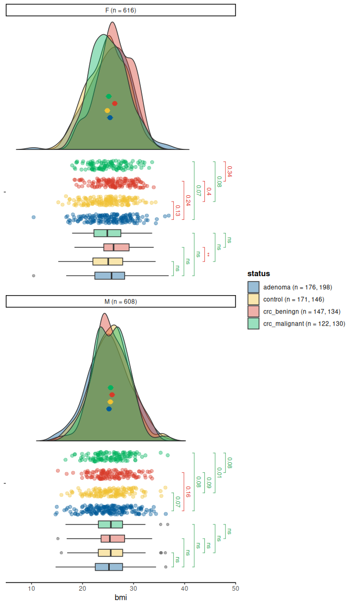

<!-- README.md is generated from README.Rmd. Please edit that file -->

# vecmatch: Generalized Propensity Score Estimation and Matching for Multiple Groups 

<!-- badges: start -->

[](https://github.com/Polymerase3/vecmatch/actions/workflows/R-CMD-check.yaml)
[](https://app.codecov.io/gh/Polymerase3/vecmatch)
[](https://github.com/Polymerase3/vecmatch/actions/workflows/style.yaml)

<!-- badges: end -->

## Overview

The `vecmatch` package implements the Vector Matching algorithm
introduced in the paper *Estimation of Causal Effects with Multiple
Treatments: A Review and New Ideas* by Lopez and Gutman (2017). This
package allows users to:

- Visualize initial covariate imbalances with elegant graphics.  
- Estimate treatment assignment probabilities using various regression
  models.  
- Define the common support region.  
- Perform matching across multiple treatment groups.  
- Evaluate the quality of matching.

## Installation

You can install the latest version of `vecmatch` from
[GitHub](https://github.com/Polymerase3/vecmatch) with:

``` r
# Install devtools if its not already installed
if(!require(devtools)){
    install.packages("devtools")
    library(devtools)
}

# Install the vecmatch package directly from github
devtools::install_github("Polymerase3/vecmatch")
```

Once the package is released on CRAN, you can install it using the
standard workflow: `install.packages("vecmatch")`.

## vecmatch Workflow

The vecmatch package has an exact workflow and it is advisable to follow
it. It consists of 5 steps and ensures the best possible matching
quality using the vector matching algorithm:

### *1. Initial imbalance assessment*

Visualize covariate imbalances in your dataset using the `raincloud()`
function for continuous variables and the `mosaic()` function for
categorical variables. Both functions support grouping by up to two
categorical variables (`group` and `facet` arguments) and provide
standardized mean differences and significance tests.

``` r
library(vecmatch)

raincloud(
  data = cancer,
  y = bmi,
  group = status,
  facet = sex,
  significance = "t_test",
  sig_label_color = TRUE,
  sig_label_size = 3,
  limits = c(7, 48)
)
#> Warning: Removed 9 rows containing missing values or values outside the scale range
#> (`geom_flat_violin()`).
```



### *2. Estimate Generalized Propensity Scores (GPS)*

Next, estimate generalized propensity scores for the treatment variable.
These scores represent treatment assignment probabilities based on
user-defined covariates. Use the `estimate_gps()` function to estimate
GPS. As a result, a matrix of generalized propensity scores is returned:

``` r
formula_cancer <- formula(status ~ bmi * sex)

gps_matrix <- estimate_gps(formula_cancer,
  data = cancer,
  method = "vglm",
  reference = "control"
)

head(gps_matrix, n = 7)
#>   treatment   control   adenoma crc_beningn crc_malignant
#> 1   control 0.3347396 0.2858184   0.1622951     0.2171469
#> 2   control 0.2397453 0.3487326   0.2006854     0.2108367
#> 3   control 0.2400506 0.2885477   0.2533414     0.2180602
#> 4   control 0.2478800 0.2856531   0.2783953     0.1880716
#> 5   control 0.2398759 0.2848793   0.2568960     0.2183489
#> 6   control 0.2652354 0.2878765   0.2518512     0.1950369
#> 7   control 0.2806189 0.2888866   0.2297684     0.2007260
```

As you can see, each row in the resulting GPS matrix contains treatment
assignment probabilities for all levels of the treatment variable,
summing to 1.

### *3. Define the Common Support Region (CSR)*

The next step involves estimating the boundaries of the common support
region (CSR). The lower and upper CSR boundaries define the range of
propensity scores where observations are present across all treatment
groups. You can calculate these boundaries by applying the `csregion()`
function to the `gps_matrix` object:

``` r
csr_matrix <- csregion(gps_matrix)
#> 
#> Rectangular CSR Borders Evaluation 
#> ==================================
#> 
#> Treatment       | Lower CSR limit | Upper CSR limit | Number excluded 
#> -------------------------------------------------------------------- 
#> control         | 0.1900629       | 0.3530295       | 27              
#> adenoma         | 0.2678156       | 0.3802609       | 20              
#> crc_beningn     | 0.1429038       | 0.3802038       | 27              
#> crc_malignant   | 0.1605948       | 0.2214335       | 27              
#> 
#> ===================================================
#> The total number of excluded observations is:     40 
#> Note: You can view the summary of the CSR calculation using the  `attr()` function.
```

The `csregion()` function outputs a matrix of generalized propensity
scores, excluding any observations that fall outside the CSR.
Additionally, it provides a summary of the process in the console. You
can retrieve additional attributes of the csr_matrix object using the
`attr()` function. Details about these attributes can be found in the
documentation for `csregion()`.

### *4. Matching on the Generalized Propensity Scores*

You can use the `csr_matrix` object to perform the actual matching with
the vector matching algorithm using the `match_gps()` function. In this
example, matching is performed without replacement, using a larger
caliper and a one-to-one matching ratio:

``` r
matched_data <- match_gps(
  csmatrix = csr_matrix,
  reference = "control",
  caliper = 1
)
```

### *5. Assessing Matching Quality*

Finally, the quality of the matching process can be evaluated using the
`balqual()` function. This function provides both mean and maximum
values for various metrics, such as the standardized mean difference,
variance ratio, and r-effect size coefficient.

``` r
balqual(matched_data,
  formula_cancer,
  statistic = "max"
)
#> 
#> Matching Quality Evaluation
#> ================================================================================ 
#> 
#> Count table for the treatment variable:
#> -------------------------------------------------- 
#> Treatment                 | Before     | After      
#> -------------------------------------------------- 
#> adenoma                   | 355        | 147        
#> control                   | 304        | 147        
#> crc_beningn               | 278        | 147        
#> crc_malignant             | 247        | 147        
#> -------------------------------------------------- 
#> 
#> 
#> Matching summary statistics:
#> ---------------------------------------- 
#> Total n before matching:  1184 
#> Total n after matching:       588 
#> % of matched observations:    49.66 %
#> Total  maximal   SMD value:   0.023 
#> Total  maximal   r value:     0.002 
#> Total  maximal   Var value:   1.015 
#> 
#> 
#> Maximal values :
#> -------------------------------------------------------------------------------- 
#> Variable                  | Coef  | Before       | After        | Quality      
#> -------------------------------------------------------------------------------- 
#> bmi                       | SMD   | 0.259        | 0.023        | Balanced     
#> bmi                       | r     | 0.010        | 0.002        | Balanced     
#> bmi                       | Var   | 1.128        | 1.015        | Balanced     
#> sexF                      | SMD   | 0.153        | 0.000        | Balanced     
#> sexF                      | r     | 0.006        | 0.000        | Balanced     
#> sexF                      | Var   | 1.004        | 1.000        | Balanced     
#> sexM                      | SMD   | 0.153        | 0.000        | Balanced     
#> sexM                      | r     | 0.006        | 0.000        | Balanced     
#> sexM                      | Var   | 1.004        | 1.000        | Balanced     
#> bmi:sexF                  | SMD   | 0.151        | 0.006        | Balanced     
#> bmi:sexF                  | r     | 0.007        | 0.001        | Balanced     
#> bmi:sexF                  | Var   | 1.046        | 1.005        | Balanced     
#> bmi:sexM                  | SMD   | 0.151        | 0.003        | Balanced     
#> bmi:sexM                  | r     | 0.006        | 0.001        | Balanced     
#> bmi:sexM                  | Var   | 1.023        | 1.003        | Balanced     
#> --------------------------------------------------------------------------------
```

## Help

You can open the full documentation of the vecmatch package using:

``` r
help(package = vecmatch)
```
